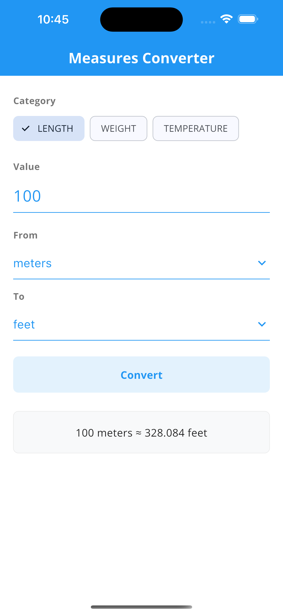
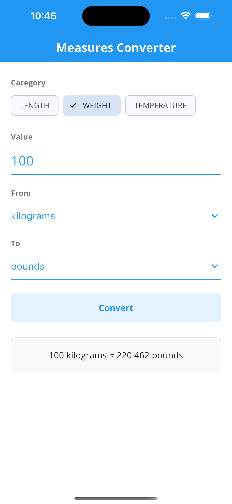
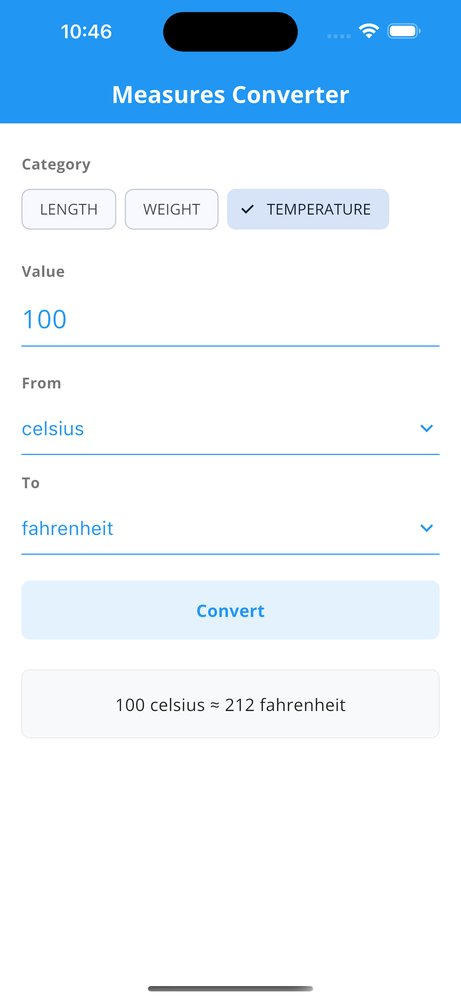

# Measures Converter App

[](https://flutter.dev/)

A Flutter application for converting between metric and imperial units (e.g., miles to kilometers, kilograms to pounds).

## Overview

This app allows users to:

- Select a measure category (Length, Weight, Temperature)
- Choose source and target units (e.g., Miles → Kilometers)
- Enter a value and convert it
- See the result only after pressing the **Convert** button

## Key Features

- Intuitive, modern UI
- Clear separation of logic and UI (industry best practice)
- Well-commented, readable code
- Follows Dart/Flutter naming conventions and standards
- Error handling for invalid input
- Unit tests for conversion logic and validation

## Project Structure

| Path/Folder                                    | Purpose/Description                                   |
| ---------------------------------------------- | ----------------------------------------------------- |
| `lib/main.dart`                                | App entry point, sets up theme and home page          |
| `lib/core/constants/app_constants.dart`        | App-wide constants (e.g., app title, precision)       |
| `lib/core/utils/conversion_utils.dart`         | Utility functions for conversions                     |
| `lib/data/units_data.dart`                     | Defines available units and categories                |
| `lib/models/measure_category.dart`             | Enum for measure categories (Length, Weight, etc.)    |
| `lib/models/unit.dart`                         | Data model for a unit (name, conversion factor, etc.) |
| `lib/pages/measure_converter_screen.dart`      | Main UI and logic for conversion                      |
| `lib/services/measure_conversion_service.dart` | Handles validation and conversion logic               |
| `lib/theme/app_colors.dart`                    | App color definitions                                 |
| `lib/theme/app_theme.dart`                     | App theming                                           |
| `lib/widgets/measure_category_selector.dart`   | Dropdown for category selection                       |
| `lib/widgets/unit_dropdown.dart`               | Dropdown for unit selection                           |
| `lib/widgets/value_input.dart`                 | Input field for value                                 |
| `lib/widgets/result_card.dart`                 | Displays conversion result                            |
| `test/conversion_service_test.dart`            | Unit tests for conversion logic                       |
| `screenshots/length_conversion.png`            | Screenshot: Length conversion                         |
| `screenshots/weight_conversion.png`            | Screenshot: Weight conversion                         |
| `screenshots/temperature_conversion.png`       | Screenshot: Temperature conversion                    |

## Quick Start

### Prerequisites

- [Flutter SDK](https://flutter.dev/docs/get-started/install)
- Dart SDK (bundled with Flutter)

### Installation

1. Clone the repository:
   ```sh
   git clone https://github.com/aashishshrestha09/mscs533_a01_flutter_unit_converter.git
   cd mscs533_a01_flutter_unit_converter
   ```
2. Install dependencies:
   ```sh
   flutter pub get
   ```
3. Run the app:
   ```sh
   flutter run
   ```

## Usage

### Run the App

Start the app on your emulator or device:

```sh
flutter run
```

### Run Unit Tests

To run all unit tests:

```sh
flutter test
```

## UI

- Clean, modern Material Design
- Responsive layout for mobile and desktop
- Category and unit selection with dropdowns and chips
- Error messages for invalid input
- Result card for conversion output

## Code Quality & Best Practices

- All major classes, methods, and widgets are documented with DartDoc comments (`///`)
- Variables and methods use descriptive, consistent names
- UI and business logic are separated for maintainability
- Error handling is implemented for invalid input
- Follows [Dart Style Guide](https://dart.dev/guides/language/effective-dart/style)

## Architecture

- **Separation of Concerns:** The app separates UI (widgets), business logic (services), and data (models/data).
- **Feature-based Structure:** Each feature (conversion, theming, etc.) has its own folder.
- **Reusable Widgets:** UI components are modular and reusable.
- **Unit Testing:** Core logic is covered by unit tests for reliability.

## Screenshots

<div align="center">

<table>
   <tr>
      <th>Length Conversion</th>
      <th>Weight Conversion</th>
      <th>Temperature Conversion</th>
   </tr>
   <tr>
      <td></td>
      <td></td>
      <td></td>
   </tr>
</table>

</div>

## Limitations & Future Work

- More unit categories (e.g., volume, area)
- Localization for multiple languages
- Dark mode support

## Credits

- [Open Sans font](https://fonts.google.com/specimen/Open+Sans) by Steve Matteson, Apache License 2.0
- [Flutter](https://flutter.dev/) for the framework
